

<!-- ============================== CABEÇALHO ============================== -->


  

&nbsp;

&nbsp;

 

<!-- ============================== SOBRE MIM ============================== -->

Sou desenvolvedor **Full Stack** formado em **Desenvolvimento de Sistemas** pela **Etec Elias Nechar**. Gosto de criar aplicações web modernas, performáticas e bem estruturadas, sempre com atenção a código limpo e boas práticas.

No momento estou me aprofundando em **React** e **Django**, e compartilho o que aprendo no Instagram **[@luz.programador](https://www.instagram.com/luz.programador/)**. Estou aberto a oportunidades, freelas e colaborações.


 

<!-- ============================== TECNOLOGIAS ============================== -->


 

<!-- ============================== COMO EU TRABALHO ============================== -->


 

<!-- ============================== ESTATÍSTICAS ============================== -->

 

<!-- ============================== CONTRIBUIÇÕES ============================== -->

  <picture>
    <source media="(prefers-color-scheme: dark)" srcset="https://raw.githubusercontent.com/SEU_USUARIO_GITHUB/SEU_USUARIO_GITHUB/output/github-contribution-grid-snake-dark.svg" />
    <source media="(prefers-color-scheme: light)" srcset="https://raw.githubusercontent.com/SEU_USUARIO_GITHUB/SEU_USUARIO_GITHUB/output/github-contribution-grid-snake.svg" />
    
  </picture>

 

<!-- ============================== CONTATO ============================== -->

Tem um projeto, uma vaga ou uma ideia para tirar do papel? Me chama no **[Instagram](https://www.instagram.com/luz.programador/)**, no **[LinkedIn](https://www.linkedin.com/in/SEU_LINKEDIN/)** ou por **[e-mail](mailto:euprogramador484@gmail.com)**. Respondo com prazer.

 

<!-- ============================== RODAPÉ ============================== -->


